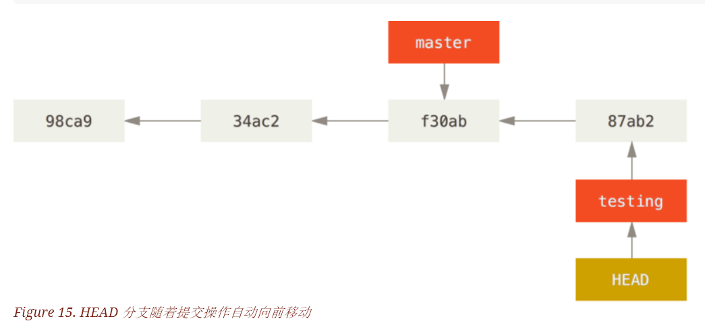
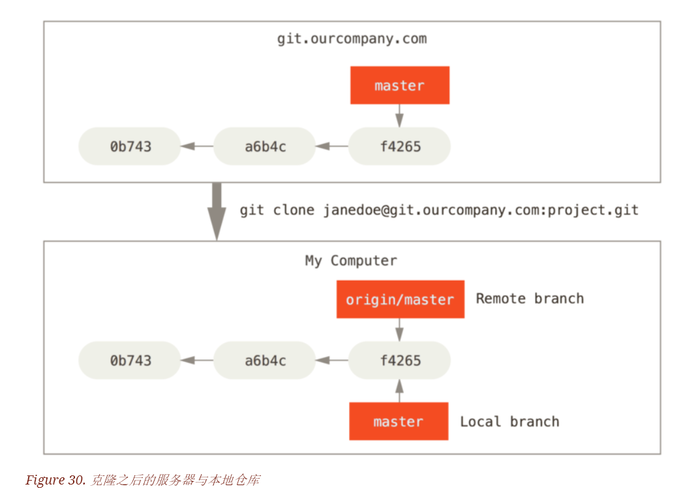

## Git分支

Git的分支模型，是git的‘必杀技特性’。

### 分支简介

先回顾一下Git是如何保存数据的。

Git保存的是一系列不同时刻的文件快照，而不是文件的变化或者差异。

提交操作时，Git会保存一个提交对象（commit object）。该提交对象保存了作者的姓名、邮箱、提交时输入的信息以及指向它的父对象的指针。首个提交对象没有父对象，普通提交对象有父对象，由多个分支合并产生的提交对象有多个父对象。

使用一个例子来说明：

假设有一个工作目录，包含三个将要被暂存和提交的文件。暂存操作为每个文件计算校验和（SHA-1 哈希算法），然后把当前版本的文件快照保存到Git仓库中（Git使用blob对象保存快照），最终将校验和加入到暂存区等待提交：

```
$ git add README test.rb LICENSE
$ git commit -m 'The initial commit of my project'
```

git commit提交时，Git先计算每个子目录的校验和，然后在Git仓库中这些校验和保存为树对象。之后，Git创建一个提交对象，该对象包含前面所述信息，还包含指向这个树对象的指针。然后，Git就可以在需要时重现此次的快照。

现在，Git仓库中有五个对象：三个blob对象（保存文件快照）、一个树对象（记录目录结构和blob对象索引）以及一个提交对象（包含指向前述树对象的指针和所有提交信息）


提交后，再次修改，再次提交。这次的提交对象会包含指向上次提交对象（父对象）的指针。


Git分支本质：指向提交对象的可变指针。 Git默认分支：master。多次提交后，会有指向最后那个提交对象的master分支，它会在每次的提交操作中自动向前移动。

master分支与其他分支完全相同，不是一个特殊的分支。 该分支是git init命令创建的，大多数人懒得更改而已。


#### 创建分支：git branch 

Git创建分支，只是创建了可以移动的新的指针。

```
git branch testing
```

该命令创建了testing分支，会在当前所在提交对象上创建新指针。 


如何确定当前分支是哪个？ Git具有特殊的HEAD指针，指向当前所在的本地分支（即HEAD是当前本地分支的别名？） git branch 仅创建一个分支，不会自动切换分支。


简单的使用git log 查看各个分支当前所指的对象。使用参数--decorate

```
$ git log --oneline --decorate
f30ab (HEAD, master, testing) add feature #32 - ability to add new
34ac2 fixed bug #1328 - stack overflow under certain conditions
98ca9 initial commit of my project
```

结果显示，当前的master分支和testing分支均指向同一个提交对象。

#### 切换分支：git checkout

```
$ git checkout testing
```

切换到 testing分支。HEAD也会指向testing分支。


这样的实现方式会带来什么好处呢？再次提交一次代码

```
$ vim test.rb
$ git commit -a -m 'made a change'
```



testing分支向前移动了，但是master分支没有移动，依旧指向运行git checkout时指向的对象。切换回master分支。

```
$ git checkout master
```


该命令做了两件事，一：使HEAD指回master分支；二：将工作目录恢复成master分支指向的快照。

注意：切换分支时，工作目录里的文件会被改变。切换到较旧的分支时，工作目录会恢复到该分支最后一次提交的样子。如果不能恢复，则禁止切换分支。

再次修改，再次提交：

```
$ vim test.rb
$ git commit -a -m 'made other changes'
```

此刻，项目的提交历史产生分叉。因为创建了test分支后，切换到test分支进行了工作，又切换回master分支进行了另外的工作。可以在不同的分支之间来回切换和工作，并在时机成熟时将它们合并起来。


可以使用git log命令简单的查看分支的历史。运行 git log --oneline --decorate --graph --all，会输出提交历史，各个分支的指向以及项目的分支分叉情况。

```
$ git log --oneline --decorate --graph --all
* c2b9e (HEAD, master) made other changes
| * 87ab2 (testing) made a change
|/
* f30ab add feature #32 - ability to add new formats to the
* 34ac2 fixed bug #1328 - stack overflow under certain conditions
* 98ca9 initial commit of my project
```

### 分支的新建与合并

#### 新建分支

首先，假设在项目上工作，并有一些提交。


为了解决某个问题，新建一个分支，新建的同时切换到该分支上工作。

```
$ git checkout -b iss53
Switched to a new branch 'iss53'
```

该命令等同于：

```
$ git branch iss53
$ git chcekout iss53
```

此时：


继续在该分支上工作，并做提交。

```
$ vim index.html
$ git commit -a -m 'added a new footer [issue 53]'
```


假设在解决这个问题的同时，突发一个紧急问题。首先，切换到master分支。

```
$ git checkout master
```

针对该紧急问题建立一个分支，在该分支上工作，直到问题解决：

```
$ git checkout -b hotfix
Switched to a new branch 'hotfix'
$ vim index.html
$ git commit -a -m 'fixed the broken email address'
[hotfix 1fb7853] fixed the broken email address
 1 file changed, 2 insertions(+)
```


然后将该分支合并到master分支，部署到线上。

```
$ git checkout master
$ git merge hotfix
Updating f42c576..3a0874c
Fast-forward
 index.html | 2 ++
 1 file changed, 2 insertions(+)
```
注意fast-forward这个词。由于master分支是该分支的直接上游，因此git只是简单移动指针。


该紧急问题被解决后,需要回到之前的工作中去.首先,删除hotfix分支，master分支已经合并了，不需要该分支了。

```
$ git branch -d hotfix
Deleted branch hotfix (3a0874c).
```

#### 分支的合并：git merge

假设iss53上的分支已经修复，需要将iss53分支合并到master分支。首先，切换到master分支，再运行git merge命令。

```
$ git checkout master
Switched to branch 'master'
$ git merge iss53
Merge made by the 'recursive' strategy.
index.html |    1 +
1 file changed, 1 insertion(+)
```

这次与合并hotfix有些不同，这次是一个简单的三方合并。即两个分支没有共同的祖先，分别从两个分支的末端快照与一个共同祖先进行三方合并。


此次三方合并的结果做了一个新快照并且自动创建一个新的提交指向它。其被称为一次合并提交。特别之处：有不止一个父提交。


#### 遇到冲突时的分支合并

冲突：在不同分支中对同一文件中同一部分进行不同的修改。假设上述分支：iss53，hotfix分别对同一文件同一部分做出了不同的修改。在git进行合并时，就会产生冲突。

```
$ git merge iss53
Auto-merging index.html
CONFLICT (content): Merge conflict in index.html
Automatic merge failed; fix conflicts and then commit the result.
```

此刻，Git做了合并，但是没有自动创建一个新的合并提交。Git将会等待我们解决合并时产生的冲突。在冲突产生后，可以使用git status 查看包含冲突而处于未合并（unmerged）状态的文件。

```
$ git status
On branch master
You have unmerged paths.
  (fix conflicts and run "git commit")

Unmerged paths:
  (use "git add <file>..." to mark resolution)

    both modified:      index.html

no changes added to commit (use "git add" and/or "git commit -a")
```

包含合并冲突而有待解决的文件，都会以未合并状态标识出来。Git会在有冲突的文件中加入标准的冲突解决标记，然后可以打开文件手动解决冲突。出现冲突的文件会包含一些特殊字段。例如：

```
<<<<<<< HEAD:index.html
<div id="footer">contact : email.support@github.com</div>
=======
<div id="footer">
 please contact us at support@github.com
</div>
>>>>>>> iss53:index.html
```

此时显示的内容分为上下两部分。等号上半部分，即HEAD所指部分，是为当前分支中的内容；等号下半部分是为iss53分支内容。为了解决冲突，可以选择一个任意一个部分的内容，或者自行合并两个部分的内容。例如：

```
<div id="footer">
please contact us at email.support@github.com
</div>
```

解决所有冲突后，使用git add 将文件标记为冲突已解决。即一旦暂存这些原本有冲突的文件，Git就会将它们标记为冲突已解决。

### 分支管理

不带参数的git branch。得到当前所有分支列表。

```
$ git branch
  iss53
* master
  testing
```

分支前的*字符，代表现在检出的分支。（现在所在的分支）如果需要查看每个分支的最后一次提交，可以使用git branch -v。

```
$ git branch -v
  iss53   93b412c fix javascript issue
* master  7a98805 Merge branch 'iss53'
  testing 782fd34 add scott to the author list in the readmes
```

查看已经合并到当前分支的分支。git branch --merged。

```
$ git branch --merged
  iss53
* master
```

查看未合并到当前分支的分支列表。git branch --no-merged。

```
$ git branch --no-merged
  testing
```

这个列表中的分支使用git branch -d删除时，会提示未merged，即删除失败。可以使用git branch -D强制删除。

### 分支开发工作流

#### 长期分支

Git使用简单的三方合并，所以反复将一个分支合并入另一个分支就不是一件难事。许多使用Git的开发者都喜欢使用这种方式来工作。比如只在master分支上保留完全稳定的代码。在develop或者next的平行分支上做后续开发或测试稳定性。当它们达到稳定状态时，就合并入master分支。

因此，稳定分支的指针总是在提交历史中落后一大截，前沿分支的指针往往比较靠前。


将其想象成流水线。


在一个非常庞大且复杂的项目中工作时，使用长期分支的方法通常很有帮助。

#### 特性分支

任何规模的项目都适合特性分支。特性分支是一种短期分支，用来实现单一特性或相关工作。

### 远程分支

远程引用是对远程仓库的引用（指针），包括分支、标签等等。可以通过git ls-remote(remote)显式获得远程引用的完整列表，或者通过git remote show(remote) 获得远程分支的更多信息。然而， 一个更常见的做法是利用远程跟踪分支。

远程跟踪分支是远程分支状态的引用。它们是你不能移动的本地引用，当你做任何网络通信操作时，它们会自动移动。远程跟踪分支像是你上次连接到远程仓库时，那些分支所处状态的书签。

它们以(remote)/(branch)形式命名。例如，你想要查看你最后一次与远程仓库origin通信时master分支的状态，你可以查看origin/master分支。 你与同事合作解决了一个问题，且他们推送一个iss53分支，你可能有自己的本地iss53分支，但是服务器上的分支会指向origin/iss53的提交。

看一个例子。假设从网络上clone一个仓库，Git的clone命令会自动将该远程仓库命名为origin，并拉取它的所有数据，创建一个指向它master分支的指针，在本地将该指针命名为origin/master。同时，Git会给予一个与origin的master分支指向同一个地方的本地master分支，这样我们就会有工作基础了。

注意：master是运行git  init时默认的起始分支名字，原因仅仅是它的广泛使用。origin是运行git clone时默认的远程仓库名字。例如运行git clone -o booyah，则默认远程分支名为booyah/master。



若本地master分支做了一些工作，同一时间，其他人推送提交到git.ourcompany.com，并更新了它的master分支，则你的提交历史将向不同的方向推进。当你不与origin服务器连接时，你的origin/master分支指针就不会移动。


如果需要同步工作，运行git fetch origin命令。该命令查找origin是哪个服务器，从中抓取本地没有的数据，并且更新本地数据库，移动origin/master指针指向新的、更新后的位置。


演示多个远程仓库与远程分支的情况。假设有另一个内部Git服务器，该服务器位于git.team1.ourcompany.com。可以运行git remote add 添加一个新的远程仓库引用到当前的项目。将该仓库命名为teamone，作为整个URL的缩写。


现在，可以运行git fetch teamone抓取远程仓库teamone有而本地没有的数据。但是，那台服务器上现有的数据是origin服务器上的一个子集，所以Git并不会抓取数据而是设置远程跟踪分支teamone/master指向teamone的master分支。


#### 推送

公开分享一个分支，即将其推送到有写入权限的远程仓库上。本地分支并不会自动与远程仓库同步，必须显示地推送想要分享的分支。可以把不愿意分享的内容放到私人分支上，将需要协作的内容推送到公开分支上。

例如共同在serverfix 分支上工作。可以运行 git push (remote) (branch) 命令推送分支。

```
$ git push origin serverfix
Counting objects: 24, done.
Delta compression using up to 8 threads.
Compressing objects: 100% (15/15), done.
Writing objects: 100% (24/24), 1.91 KiB | 0 bytes/s, done.
Total 24 (delta 2), reused 0 (delta 0)
To https://github.com/schacon/simplegit
 * [new branch]      serverfix -> serverfix
```

这里的工作被简化了。 Git自动将serverfix分支名字展开为 refs/heads/serverfix:refs/heads/serverfix 。即，推送本地的serverfix分支来更新远程仓库上的serverfix分支。  可以运行git push origin serverfix命令得到同样的效果。即也是推送本地的serverfix 分支，作为远程仓库的serverfix分支。 可以通过这种方式 将本地分支推送到一个命名不相同的远程分支。也可以更改远程分支名， 即 git push origin serverfix:awesomebranch 将本地的serverfix分支推送到远程的 awesomebranch 分支。

下一次其他协作者从服务器上抓取数据时，会在本地生成一个远程跟踪分支origin/serverfix，指向服务器的serverfix分支的引用。

```
$ git fetch origin
remote: Counting objects: 7, done.
remote: Compressing objects: 100% (2/2), done.
remote: Total 3 (delta 0), reused 3 (delta 0)
Unpacking objects: 100% (3/3), done.
From https://github.com/schacon/simplegit
 * [new branch]      serverfix    -> origin/serverfix
```

注意：抓取到的新的远程跟踪分支时，本地不会自动生成一份可编辑的副本（拷贝）。即在这种情况下，不会有一个新的serverfix分支，只有一个不可以修改的origin/serverfix指针。

可以运行 git merge origin/serverfix 将这些工作合并到当前所在的分支。如果想要在自己的serverfix分支工作，可以将该分支建立在远程跟踪分支上。

```
$ git checkout -b serverfix origin/serverfix
Branch serverfix set up to track remote branch serverfix from origin.
Switched to a new branch 'serverfix'
```

这样后，就创建了一个用于工作的本地分支，并且起点位于origin/serverfix。

#### 跟踪分支 

从一个远程跟踪分支检出一个本地分支会自动创建一个跟踪分支（或者称为上游分支）。跟踪分支是与远程分支有直接关系的本地分支。若在跟踪分支上使用git pull命令，Git能自动识别去哪个服务器抓取、合并到哪个分支。

克隆一个仓库时，通常自动创建一个跟踪origin/master的master分支。可以自己设置其他的跟踪分支-其他远程仓库上的跟踪分支，或者不跟踪master分支。可以运行git checkout -b [branch] [remotename]/[branch]来设置跟踪分支。

Git提供了快捷方式。

```
$ git checkout --track origin/serverfix
Branch serverfix set up to track remote branch serverfix from origin.
Switched to a new branch 'serverfix'
```

