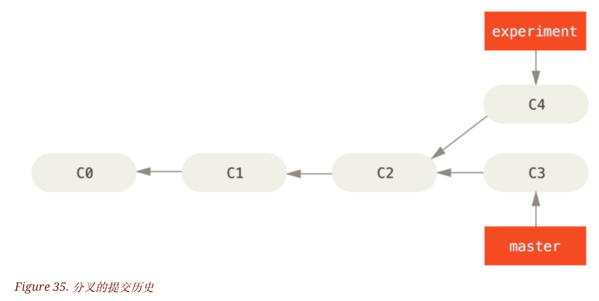
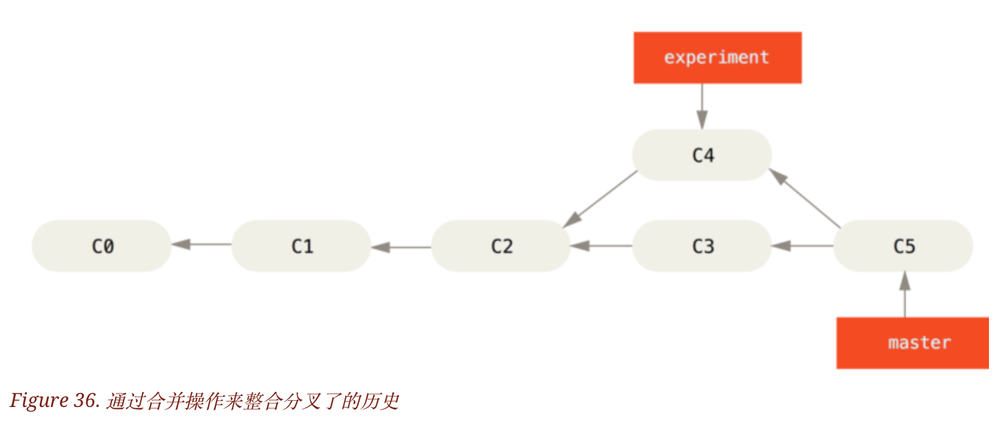
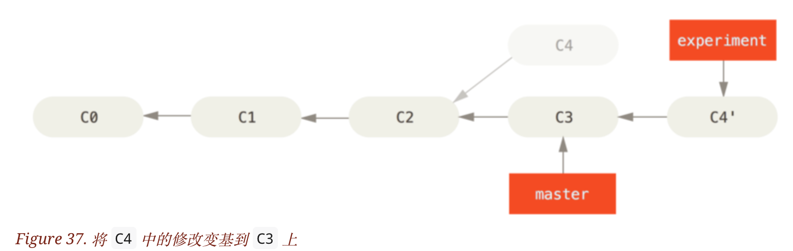
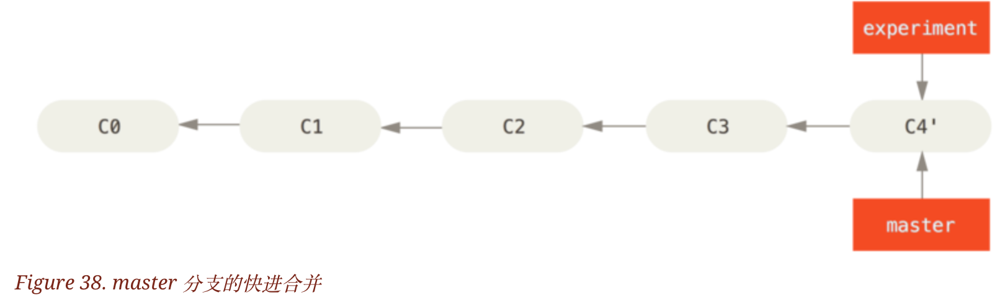
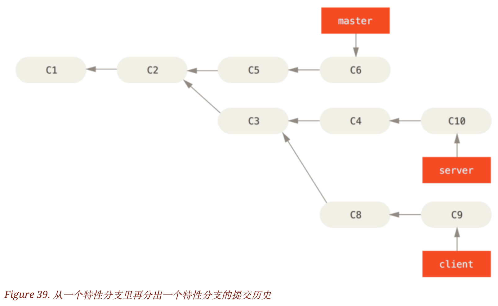
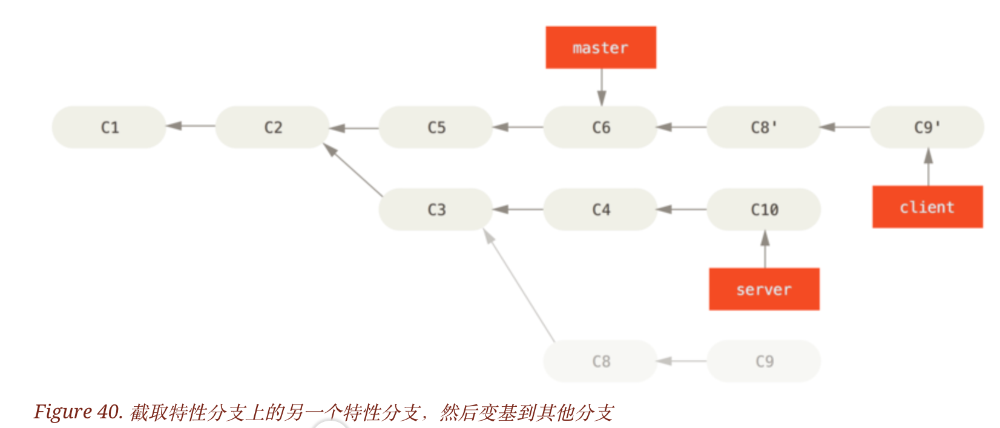
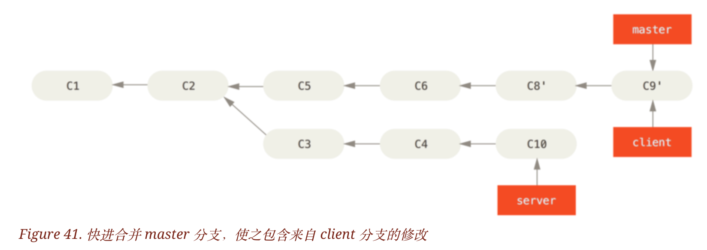
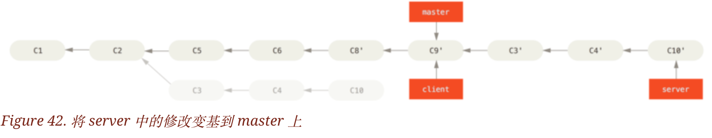
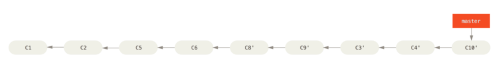

# 变基

Git  中整合分支的方法主要有两种：merge 和 rebase。

## 变基的基本操作: git rebase

分叉的提交历史：



使用 merge 整合分支，进行一个三方合并。

使用两个分支的最新快照：c3 和 c4 ,以及二者最近的共同祖先 c2 进行三方合并。合并结果：生成新的快照（并提交）。



通过变基合并：提取 c4 中的补丁和修改，在 c3 的基础上应用一次。

```
$ git checkout experiment
$ git rebase master
First, rewinding head to replay your work on top of it...
Applying: added staged command
```

原理：找到 expriment 、master 分支（变基操作的目标基底分支）的最近共同祖先 c2 。然后，将当前分支做的修改提取出来，作为临时文件。之后，将当前分支指向目标基底 c3 ,最后将临时文件应用到 c3 上，形成一个新的提交 c4。



然后可以进行快进合并。

```
git checkout master
git merge experiment
```



此时 c4' 指向的快照就和 c5 指向的快照相同。

两种方式整合的结果是相同的。只是 rebase 的方式，使 git 的历史更加整洁。提交历史是一条直线，没有分叉。

## 有趣的变基例子

两个分支进行的变基，可以应用到另一个分支上。



目标：将 client 分支中才有的修改应用到 master 分支上（即不需要 c3 指向的快照）。

```
git rebase --onto master server client
```

解释：将 server 分支和 client 分支共同祖先之后的修改应用在 master 分支上。



然后快进合并：

```
git checkout master
git merge client
```



### 不用切换到目的分支的变基方法： git rebase [basebranch] [topicbranch]

目的：整合 server 分支。（给 server 分支变基）

```
git rebase master server 
```



快进合并：

```
git checkout master
git merge server
```

删除无用的分支：

```
git branch -d client
git branch -d server
```

最后的样子：



