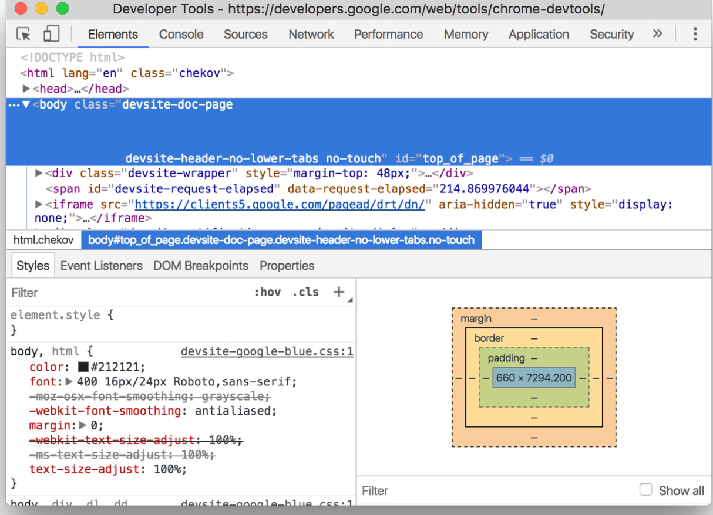
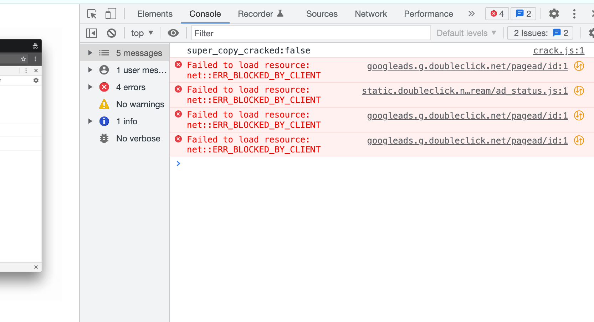
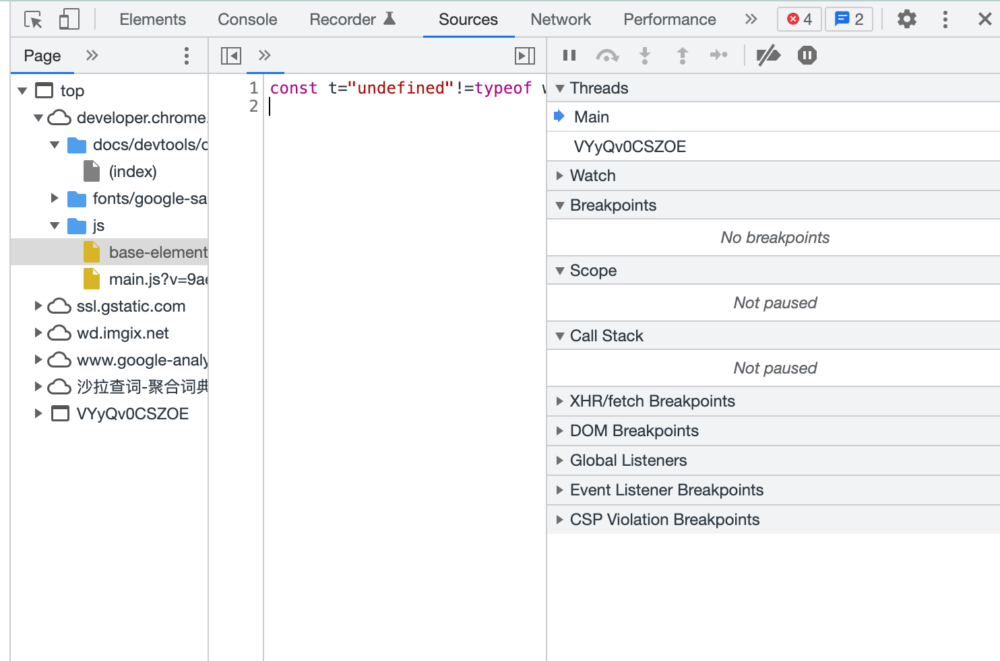
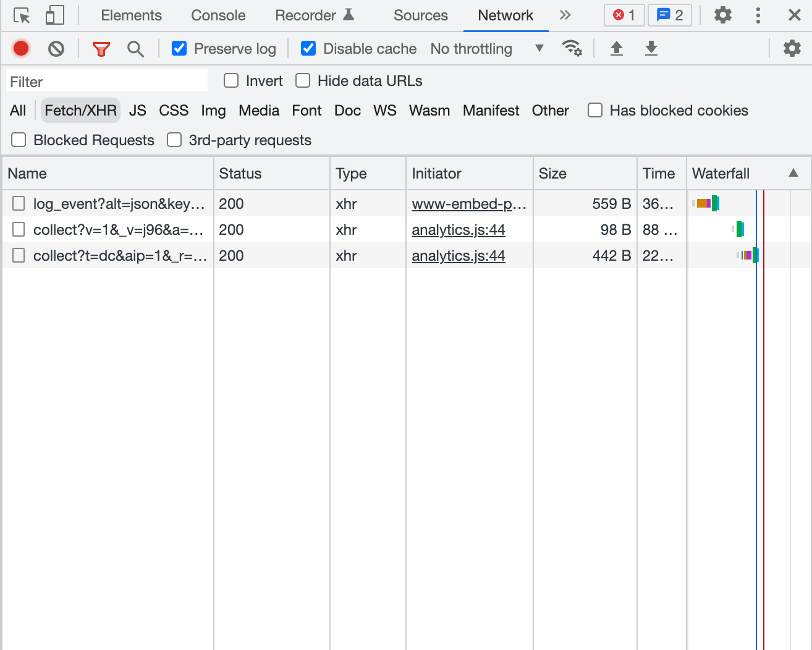
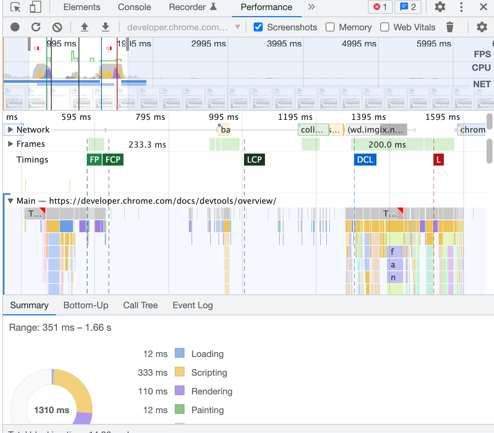
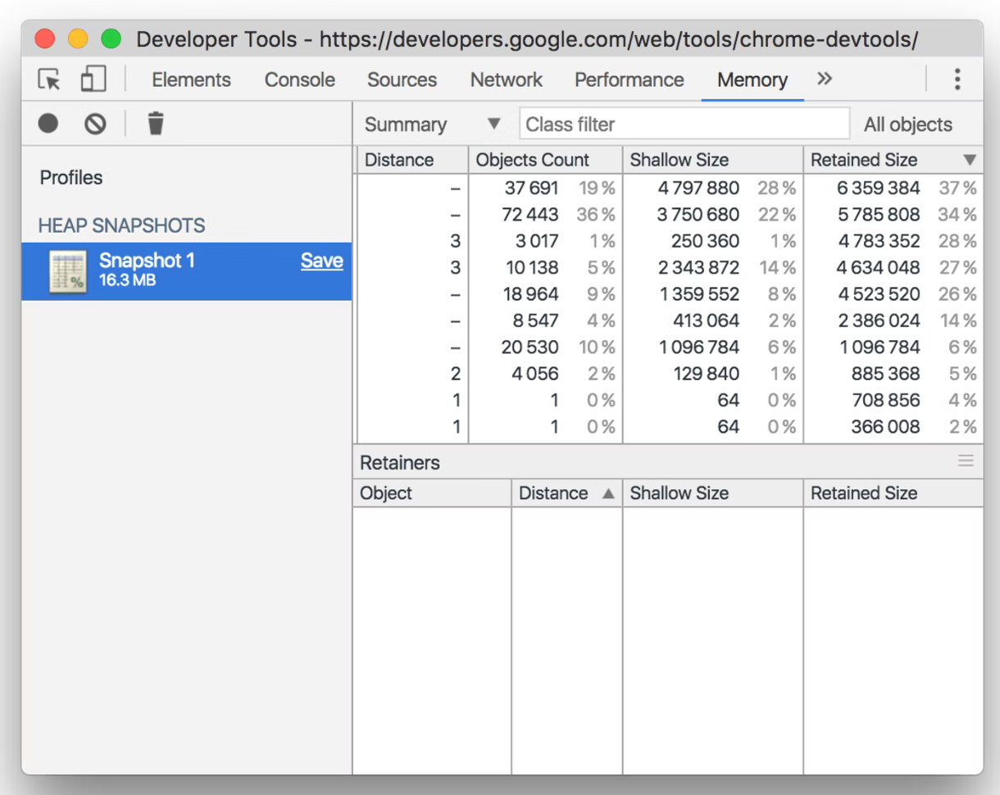
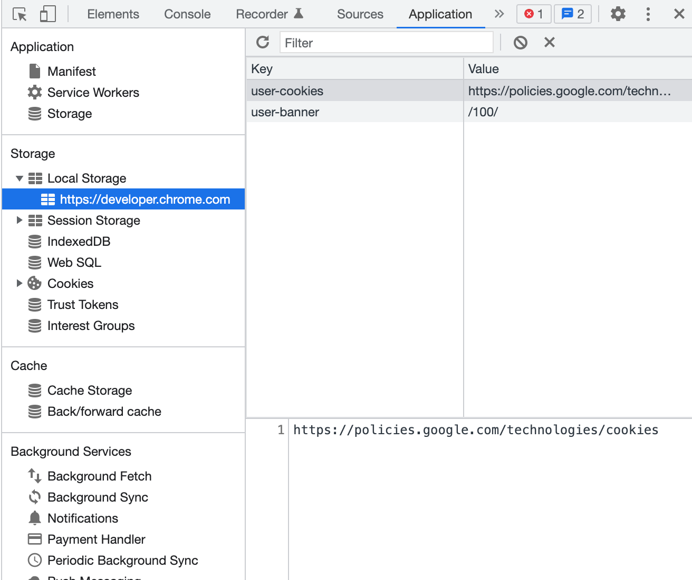
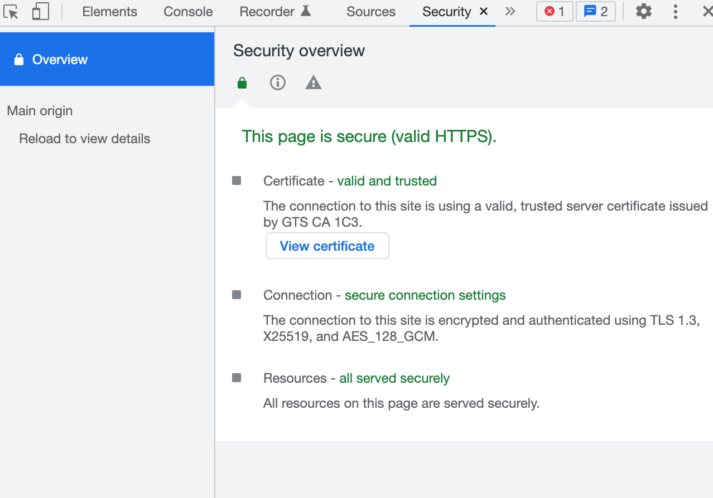

# 总览

## 打开 DevTools

* check DOM or CSS , Mac:  Command+Option+C  Win: Control+Shift+C 。或者，在页面上右键，选择 inspect （检查、审查）
* run JavaScript or log, Mac: Command+Option+C Win: Control+Shift+C。打开 console。

## 了解 DevTools

### Device Mode 

### Elements Panel

元素面板，能够查看、改变 DOM 和 CSS

### Console panel

控制台面板，能够查看 log 出来的信息，或者运行 JavaScript 代码。

### Sources panel

资源面板：能够在这里调试 JavaScript

### Network panel

网络面板：能够在这里查看和调试网络。

### Performance panel

性能面板：在这里能看到加载和运行时的一些性能表现。

###  Memory panel

内存面板。

###  Application panel

应用程序面板：可以查看所有被加载进来的资源，包括：indexedDB、Web SQL databases、local and session storage、cookies、Application Cache、images、fonts、stylesheets

### Security panel

安全面板：能够看到一些安全相关的问题，比如证书等。