## 在浏览器中调试

调试：在一个脚本中找出并修复错误的过程。

这里使用 chrome 当作例子。

## 资源（source）面板

在 Chrome 中打开开发者工具，选择 source 选项。会看到如下面板：

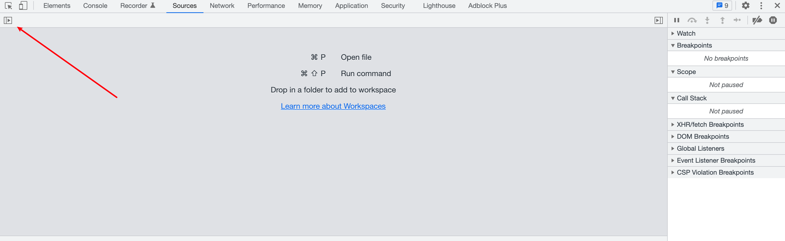
箭头所指按钮为显示文件列表。

在文件树中，选择 hello.js,出现如下面板。

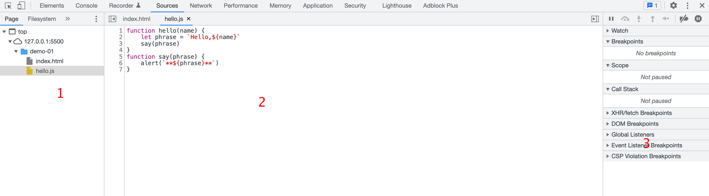

* 1 代表文件导航（File Navigator）区域，列出 HTML、JavaScript、CSS 和 包括图片在内的其他依附于此页面的文件。Chrome 的扩展程序也会显示在这。
* 2 是代码编辑（Code Editor）区域，展示源代码。
* 3 是 JavaScript 调试（JavaScript Debugging）区域，用于调试。

## 控制台（Console）

Esc 可以切换控制台的显示

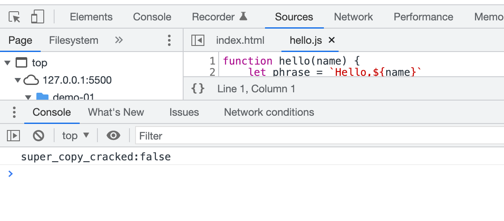

可以在控制台输入语句，按下 Enter 键执行语句。语句执行完毕后的结果，会显示在控制台。

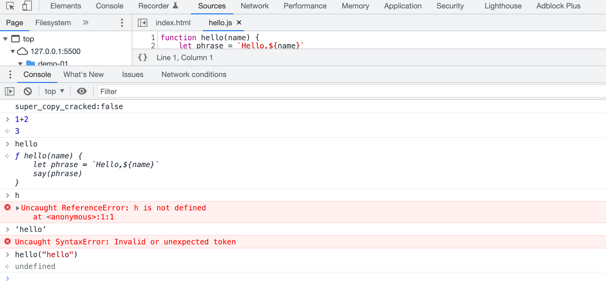

## 断点（Breakpoints）

图中蓝色的地方为断点。

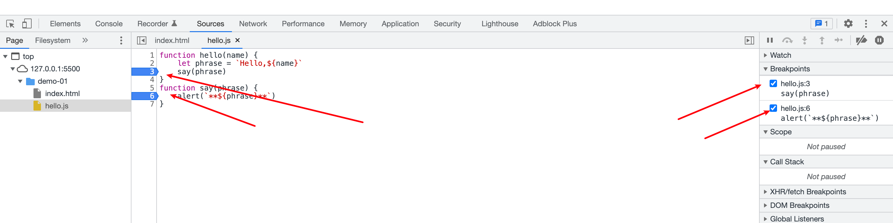

断点：调试器会自动暂停 JavaScript 执行的地方。

代码暂停时，可以在代码编辑区检查当前的变量、在控制台执行命令。

右侧箭头处是断点列表：

* 点击列表中的断点，可快速跳转到到代码中对应的断点。
* 取消列表中选中的断点，可以临时禁用断点
* 可以右键单击，选择移除一个断点

tip: 创建条件断点？在行号上右键选择条件断点即可。需要在特定的变量或参数的情况下暂停程序执行时，该调试方法就很有用。

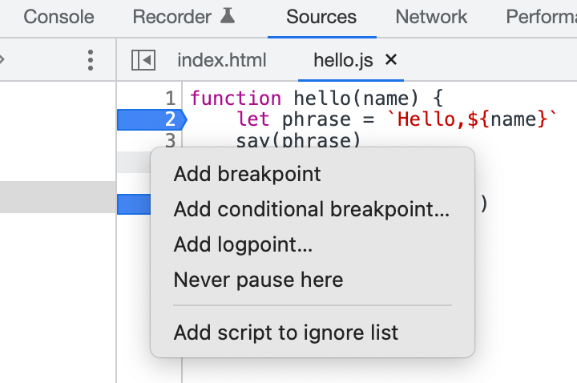

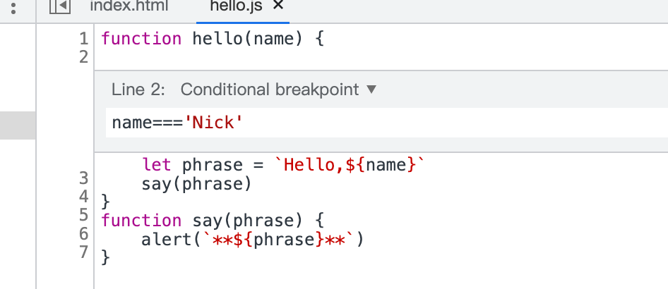

## Debugger 命令

使用 debugger 命令暂停代码的执行。

```js
function hello(name) {
  let phrase = `Hello, ${name}!`;

  debugger;  // <-- 调试器会在这停止

  say(phrase);
}
```

当代码很复杂，在开发者工具中查找脚本来设置断点时，比较麻烦。就可以在代码编辑器中使用 debugger 命令。

## 暂停并查看

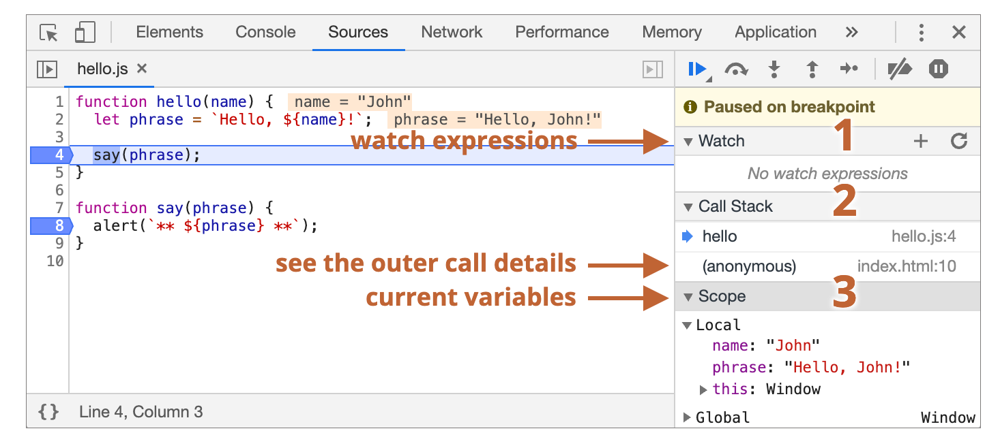

设置了断点后，代码首先在第 4 行暂停执行。此时可以在右侧的信息列表中，查看代码状态。

* 查看 Watch - 显示任意表达式的当前值

  点击 + ，输入一个表达式。调试器能够随时显示它的值，并在执行过程中自动重新计算该表达式。

  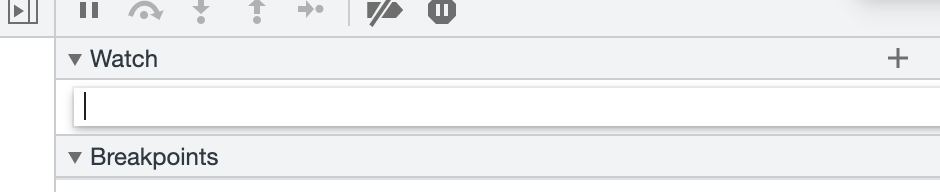

* 调用栈 Call Stack - 显示嵌套的调用链

  此刻，图片上的调试器在 `hello()`函数的调用链中，（`hello()`函数）被 `index.html`中的一个脚本调用（这里没有函数，所以显示 anonymous）

  点击对应的堆栈项，调试器会跳到对应的代码处，能够查看其所有的变量

* 作用域 Scope - 显示当前的变量

  Local 显示当前执行函数中变量此刻的值，在源代码中，它们的值也被高亮的显示

  Local 中的 this ,显示的是当前执行函数 this 的指向

  Global 显示全局变量（不在任何函数中）

## 跟踪执行

 跟踪执行，即跟踪脚本的执行。

右侧面板的顶部是关于跟踪执行的按钮。

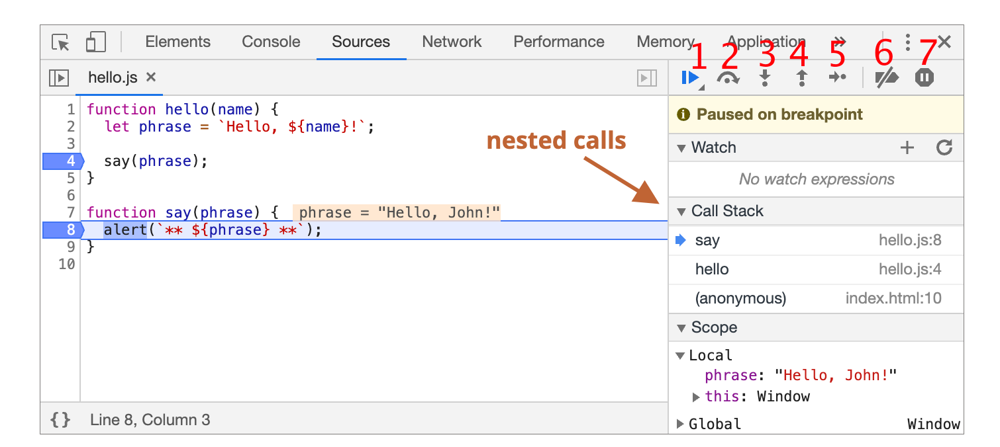

* 1 恢复（Resume），即继续执行代码。

   继续执行代码，如果没有其他断点就会一直执行下去，调试器不会再控制程序。
   
* 2 跨步（Step over next function call），运行下一条指令，但不会进入到函数中
  
  该命令和下一步 （Step）有些相似，但在遇到函数（不是内建的函数，如 alert ，而是自己编写的函数）时，两者的表现则有些不同。
  
  Step 命令执行函数，进入函数内部，在函数内部第一步暂停执行。 Step over next function call 命令执行函数，会跳过函数的内部，在该函数执行完毕后立即停止。当我们对某个函数内部不感兴趣时，这个命令就很有用。
  
* 3 步入（Step into next function call)，
  
  类似 Step ，但在异步函数调用的情况有些不同。
  
  Step 会忽略异步行为，例如 setTimeout。 Step into 会进入到代码中并等待（如果需要）
  
* 4 步出（Step out of current function）,继续执行到当前函数的末尾
  
  继续执行代码，并停留在当前函数的最后一行。使用 Step into 偶然进入到一个嵌套调用时，我们对此函数并不感兴趣，只想要尽可能的继续执行到该函数的最后。这时，使用 Step out 是非常方便的。
  
* 5 下一步（Step）,运行下一条指令
  
  运行下一条语句。一次一次的点击此按钮，整个脚本的所有语句会逐个执行。
  
* 6 启用/禁用 所有的断点
  
  批量操作断点的开关
  
* 7 启用/禁用 出现错误时，自动暂停脚本执行

   在开发者工具中启动此功能时，任何一个脚本的错误都会导致该脚本执行自动暂停。

   因此，当脚本出现错误时，可以启用这个选项，查看一下脚本挂掉的地方和当时的上下文。

tip: Continue to here

在某行代码上右键，出现一些可选项，其中的 Continue to here 项，是非常有用的。

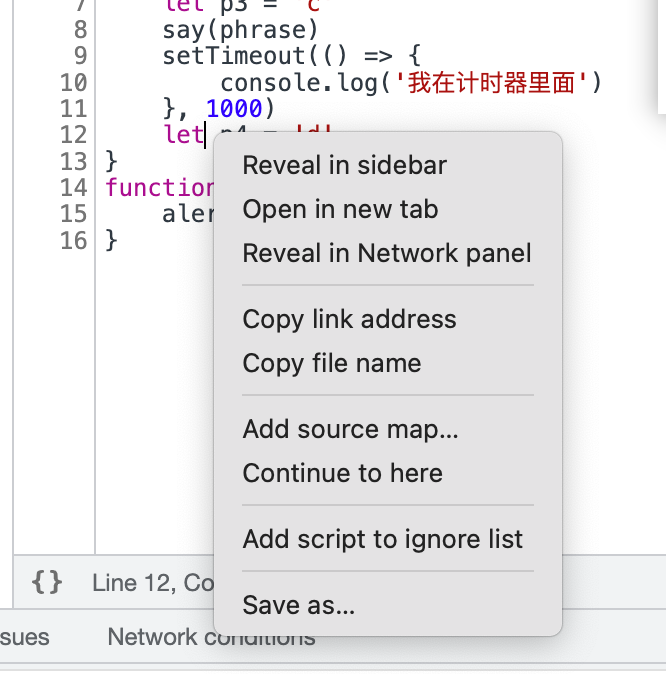

当想要代码执行到某一行且到此行为止时，除了设置断点的方式。也可以使用这个选项。

## 日志记录

使用 `console.log`输出东西到控制台。

